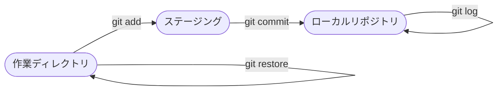

# 📘 Git ローカルリポジトリ 操作マニュアル

> **本書について**  
> Git のローカルリポジトリ操作を、作業フロー順にわかりやすく解説します。  
> コマンド例と実行結果サンプルを併記し、はじめての方でも手を動かしながら学べます。

---

## 🗺️ Git 基本ワークフロー

---

## 📑 目次

| # | 作業 | 主なコマンド |
|---|------|-------------|
| [1](section1.md) | リポジトリの初期化 | `git init` |
| [2](section2.md) | ファイルのステージング | `git add` |
| [3](section3.md) | コミット | `git commit` |
| [4](section4.md) | ブランチの操作 | `git branch` / `git switch` |
| [5](section5.md) | マージ | `git merge` |
| [6](section6.md) | 状態・差分の確認 | `git status` / `git diff` |
| [7](section7.md) | ログの確認 | `git log` |
| [8](section8.md) | 変更の取り消し | `git restore` / `git reset` |

---

> 💡 **Tip:** 各章のリンクをクリックすると詳細ページに移動します。
