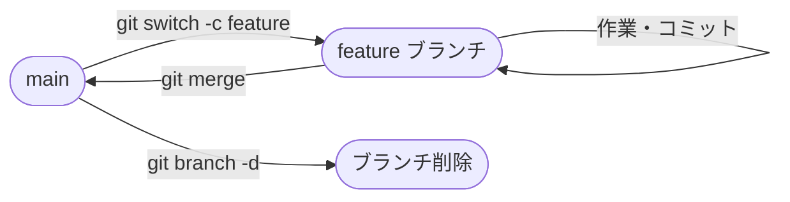

# 🌿 第4章  ブランチの操作


> ブランチを使って作業を分岐させ、安全に並行開発を進めます。

## 🌟 この章でわかること

- `git switch -c` で新規ブランチを作成して切り替える方法
- `git branch -d` で不要ブランチを整理する方法

---

## 🔄 フロー



---

## 📋 手順

1. `git branch` で現在のブランチを確認します。
2. 新しいブランチを作成して切り替えます。
3. 作業完了後、不要なブランチを削除します。

---

## 💻 コマンドと実行結果

```bash
$ git branch
```

```
* main
```

```bash
$ git switch -c feature/login
```

```
Switched to a new branch 'feature/login'
```

```bash
$ git branch
```

```
* feature/login
  main
```

```bash
$ git branch -d feature/login
```

```
Deleted branch feature/login (was a1b2c3d).
```

> 💡 **Tip:** ブランチ名は `feature/機能名` や `fix/不具合名` のように分類すると管理しやすくなります。

---
[← 前章](section3.md) ｜ [目次へ戻る](gitmanual.md) ｜ [次章 →](section5.md)
