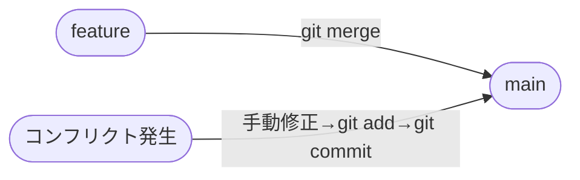

# 🤝 第5章  マージ


> 別のブランチの変更を現在のブランチに統合します。

## 🌟 この章でわかること

- `git merge` でブランチを統合する基本フロー
- コンフリクト発生時の修正からコミットまでの流れ

---

## 🔄 フロー



---

## 📋 手順

1. マージ先のブランチに切り替えます。
2. `git merge` でブランチを統合します。
3. コンフリクトが発生した場合は修正してコミットします。

---

## 💻 コマンドと実行結果

```bash
$ git switch main
$ git merge feature/login
```

```
Updating a1b2c3d..e4f5a6b
Fast-forward
 login.html | 20 ++++++++++++++++++++
 1 file changed, 20 insertions(+)
```

```bash
# コンフリクト発生時
$ git merge feature/config
```

```
Auto-merging config.json
CONFLICT (content): Merge conflict in config.json
Automatic merge failed; fix conflicts and then commit the result.
```

```bash
# 修正後
$ git add config.json
$ git commit -m "Merge feature/config"
```

> ⚠️ **Note:** `<<<<<<` `=======` `>>>>>>>` の印を探してコンフリクト箇所を修正します。

---
[← 前章](section4.md) ｜ [目次へ戻る](gitmanual.md) ｜ [次章 →](section6.md)
